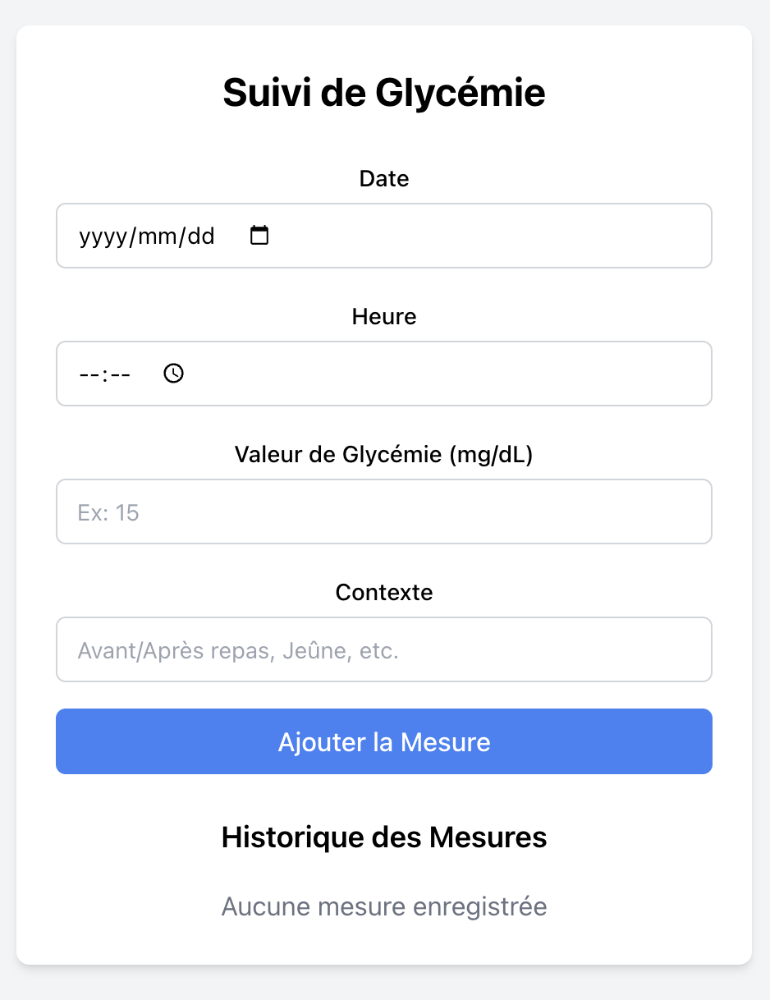

# Suivi de Glycémie

<!--  -->


Une application web simple et efficace pour suivre vos niveaux de glycémie quotidiens.

## Fonctionnalités

- Interface entièrement en français
- Enregistrement de jusqu'à 3 mesures de glycémie par jour
- Sauvegarde automatique des données dans le navigateur (localStorage)
- Exportation des données au format CSV pour analyse


## Installation

```bash
# Cloner le dépôt
git clone https://github.com/Cheto01/glycemia-tracker.git

# Naviguer dans le répertoire du projet
cd glycemia-tracker

# Installer les dépendances
npm install

# Démarrer l'application en mode développement
npm start
```

L'application sera accessible à l'adresse [http://localhost:3000](http://localhost:3000) dans votre navigateur.

## Utilisation

1. **Ajouter une mesure de glycémie**
   - Remplissez le formulaire avec la date, l'heure, la valeur et le contexte
   - Cliquez sur "Ajouter la Mesure"
   - Note : maximum 3 mesures par jour (vous pouvez changer cela à vos besoins)

2. **Consulter l'historique**
   - Toutes vos mesures sont affichées dans la section "Historique des Mesures"
   - Les mesures sont automatiquement sauvegardées dans le navigateur

3. **Supprimer une mesure**
   - Cliquez sur le bouton "Supprimer" à côté de la mesure concernée

4. **Exporter les données**
   - Cliquez sur "Exporter les Données (CSV)"
   - Le fichier CSV peut être ouvert dans Excel ou Google Sheets
   - Utilisez vos données exportées pour analyser vos tendances

<!-- ## Visualisation des Données

### Excel / Google Sheets
Après avoir exporté vos données au format CSV, vous pouvez les importer dans Excel ou Google Sheets pour créer des graphiques :

1. Ouvrez Excel ou Google Sheets
2. Importez le fichier CSV (Fichier > Importer)
3. Sélectionnez vos données
4. Insérez un graphique linéaire pour visualiser l'évolution de votre glycémie dans le temps

### Python (avec pandas et matplotlib)
```python
import pandas as pd
import matplotlib.pyplot as plt

# Charger les données
data = pd.read_csv('suivi_glycemie.csv')

# Convertir la date en format datetime
data['Date'] = pd.to_datetime(data['Date'])

# Créer un graphique
plt.figure(figsize=(12, 6))
plt.plot(data['Date'], data['Valeur'], 'o-', color='blue')
plt.title('Évolution de la Glycémie')
plt.xlabel('Date')
plt.ylabel('Glycémie (mg/dL)')
plt.grid(True)
plt.xticks(rotation=45)
plt.tight_layout()
plt.show()
``` -->

## Déploiement

### Vercel (simple)
1. Créez un compte sur [Vercel](https://vercel.com)
2. Connectez votre compte GitHub
3. Importez votre dépôt
4. Vercel détectera automatiquement qu'il s'agit d'une application React
5. Cliquez sur "Deploy"

### Netlify
1. Créez un compte sur [Netlify](https://netlify.com)
2. Cliquez sur "New site from Git"
3. Sélectionnez votre dépôt GitHub
4. Configuration de build :
   - Build command : `npm run build`
   - Publish directory : `build`
5. Cliquez sur "Deploy site"

### GitHub Pages
1. Installez gh-pages : `npm install --save gh-pages`
2. Ajoutez à votre package.json :
   ```json
   "homepage": "https://votre-nom.github.io/glycemia-tracker",
   "scripts": {
     "predeploy": "npm run build",
     "deploy": "gh-pages -d build"
   }
   ```
3. Exécutez : `npm run deploy`

<!-- ## Personnalisation

### Changer l'unité de mesure (mg/dL à mmol/L)
Modifiez la ligne suivante dans `GlycemiaTracker.js` :
```javascript
<Label htmlFor="value">Valeur de Glycémie (mmol/L)</Label>
```

### Ajouter plus de contextes prédéfinis
Ajoutez une liste déroulante en remplaçant le champ de texte par :
```javascript
<select
  id="context"
  name="context"
  value={newRecord.context}
  onChange={handleInputChange}
  className="mt-1 block w-full rounded-md border-gray-300"
>
  <option value="">Sélectionner...</option>
  <option value="À jeun">À jeun</option>
  <option value="Avant repas">Avant repas</option>
  <option value="Après repas">Après repas</option>
  <option value="Avant activité">Avant activité</option>
  <option value="Après activité">Après activité</option>
</select>
``` -->

## Technologies Utilisées

- React.js
- Tailwind CSS 
- LocalStorage API

## Licence

MIT

## Contact

Pour toute question ou suggestion, n'hésitez pas à ouvrir une issue sur GitHub ou à me contacter à [d8222105@gmail.com](mailto:d8222105@gmail.com).